# � GRIDLORD — Fantasy Draft War Room

Multi-source rankings, a live draft assistant, deep player intelligence, and
predictive analytics — built around **your** league's exact rules. Installable as
a phone app (PWA) and deployable as a website via GitHub Pages.

- **Frontend:** React + Vite + TailwindCSS (installable **PWA**)
- **Backend:** FastAPI + SQLAlchemy
- **Database:** SQLite (local dev) / PostgreSQL (prod)
- **Auth:** JWT sign-in so your league settings + custom draft board follow you

Pre-seeded with **"The League"** — a real 14-team H2H PPR league (bonus yardage).

## Feature highlights

| Area | Highlights |
| --- | --- |
| **Rankings** | Sleeper 2026 projections **+ FantasyPros expert consensus (ECR)** blended, **league-size-aware VORP** (14- vs 12-team changes value), boom/bust %, ADP divergence, explainable drivers |
| **Live Draft** | Roster-construction pick logic (2-RB / zero-RB), **opponent tendency modeling**, **positional run forecast**, survival probability |
| **My Board** | Build & save your own draft board (reorder from consensus) |
| **Player Intel** | Analyst buzz velocity, role-change flags, boom/bust, ECR movement, practice/injury |
| **News Wire** | 6 national feeds + **beat writers / local papers / press conferences for all 32 teams** + analyst YouTube buzz — NLP-tagged (injury/role/practice/coach-speak) |
| **League Setup** | No-JSON editor — change scoring and **projections re-score instantly** |

## 📱 Install on your phone (PWA)
1. Open the deployed site on your phone.
2. **iPhone/Safari:** Share → *Add to Home Screen*. **Android/Chrome:** ⋮ → *Install app*.
3. Launches full-screen with the GRIDLORD icon; app shell works offline.
   Data still needs the backend — set `VITE_API_BASE` to your backend URL.

## 🌐 Open as a website (GitHub Pages)
A workflow ([.github/workflows/pages.yml](.github/workflows/pages.yml)) builds and
deploys the frontend on every push to `main`.
1. **Settings → Pages → Source: GitHub Actions.**
2. (Optional) **Settings → Secrets and variables → Actions → Variables** → add
   `API_BASE` = your deployed backend URL.
3. Site publishes at `https://<user>.github.io/<repo>/`. Routing uses `HashRouter`,
   so deep links work with no extra Pages config.

> GitHub Pages is static — host the FastAPI backend separately (Render / Railway /
> Fly.io) and point `API_BASE` at it. See [docs/OPERATIONS.md](docs/OPERATIONS.md).

---

## Architecture

```mermaid
flowchart LR
  subgraph FE[Frontend · React + Tailwind]
    DASH[Dashboard]
    LS[League Settings]
    DR[Draft Room / Live Assistant]
    LO[Lineup Optimizer]
    TA[Trade Analyzer]
    WB[Waiver Board]
    PP[Player Page]
    ML[Multi-league]
  end

  subgraph API[Backend · FastAPI]
    RL[/api/leagues/]
    RP[/api/players/]
    RPR[/api/projections/]
    RD[/api/draft/]
    RW[/api/waivers/]
    RT[/api/trades/]
    RS[/api/sync/]
  end

  subgraph ENG[Analytics Engine]
    SC[Scoring Engine]
    PE[Projection Ensemble]
    MC[Monte Carlo Sim · 10k]
    RK[Ranking Engine · VORP]
    DE[Draft Engine · live recs]
    HG[Hidden Gems]
  end

  subgraph PRV[Unified Provider Interface]
    SL[Sleeper]
    ES[ESPN]
    YH[Yahoo]
    NF[NFL]
    SCR[Generic Scraper]
  end

  DB[(PostgreSQL / SQLite)]
  RDS[(Redis cache)]

  FE --> API --> ENG
  API --> PRV --> DB
  ENG --> DB
  ENG --> RDS
```



---

## Quick start

### 1. Install skills (optional dev tooling)

```bash
# macOS/Linux
bash scripts/install-skills.sh
# Windows PowerShell
pwsh scripts/install-skills.ps1
```

These run:

```bash
npx skills add https://github.com/vercel-labs/skills --skill find-skills
npx skills add https://github.com/mattpocock/skills --skill grill-me
npx skills add https://github.com/anthropics/skills --skill frontend-design
npx skills add https://github.com/mattpocock/skills --skill improve-codebase-architecture
```

### 2. Backend

```bash
cd backend
python -m venv .venv && . .venv/Scripts/activate   # Windows
# source .venv/bin/activate                          # macOS/Linux
pip install -r requirements.txt
python -m app.seed          # seed DB with "The League" defaults + sample players
uvicorn main:app --reload   # http://localhost:8000  (docs at /docs)
```

### 3. Frontend

```bash
cd frontend
npm install
npm run dev                 # http://localhost:5173
npm run format              # Prettier
```

### 4. Docker (all-in-one)

```bash
docker compose up --build
```

---

## Feature map → code

| Feature | Location |
| --- | --- |
| Scoring engine (your league) | [backend/app/engine/scoring.py](backend/app/engine/scoring.py) |
| Projection ensemble | [backend/app/engine/projections.py](backend/app/engine/projections.py) |
| Monte Carlo season sim | [backend/app/engine/montecarlo.py](backend/app/engine/montecarlo.py) |
| Ranking engine (VORP) | [backend/app/engine/rankings.py](backend/app/engine/rankings.py) |
| Live draft assistant | [backend/app/engine/draft_engine.py](backend/app/engine/draft_engine.py) |
| Lineup optimizer | [backend/app/engine/lineup_optimizer.py](backend/app/engine/lineup_optimizer.py) |
| Trade analyzer | [backend/app/engine/trade_analyzer.py](backend/app/engine/trade_analyzer.py) |
| Waiver / FAAB | [backend/app/engine/waivers.py](backend/app/engine/waivers.py) |
| Hidden gems | [backend/app/engine/hidden_gems.py](backend/app/engine/hidden_gems.py) |
| Provider interface | [backend/app/providers/base.py](backend/app/providers/base.py) |
| Sleeper adapter | [backend/app/providers/sleeper.py](backend/app/providers/sleeper.py) |
| Field auto-mapping | [backend/app/mapping.py](backend/app/mapping.py) |

---

## Live Draft Assistant

Open **Draft Room → Live** and enter, in real time:

1. **Your draft slot** (e.g., pick 7 of 14).
2. Each pick as it happens (player + team), for picks before and after you.

The engine returns, on every pick:

- **Best available** ranked by VORP for your league's exact scoring.
- **Positional-need weighting** based on the roster you've already built.
- **Scarcity cliffs** — how many quality starters remain at each position before your next pick.
- **Picks until you're up again** (snake math) and the tier likely to survive the wheel.
- **Top-3 explainability drivers** for each recommendation.

API: `POST /api/draft/recommend` — see [docs/API.md](docs/API.md).

---

## Adding a new provider adapter

1. Subclass `FantasyProvider` in [backend/app/providers/base.py](backend/app/providers/base.py).
2. Implement the 7 interface methods.
3. Register it in `get_provider` in [backend/app/providers/__init__.py](backend/app/providers/__init__.py).
4. Add field mappings in [backend/app/mapping.py](backend/app/mapping.py).

---

## Performance targets

| Operation | Target | Strategy |
| --- | --- | --- |
| 1,000 mock drafts | < 60s local | Vectorized NumPy, cached VORP board |
| Lineup optimizer | < 2s | Cached projections, greedy + ILP fallback |
| 10k Monte Carlo season sims | < 30s | NumPy vectorization, Redis cache w/ TTL |
| Daily ranking refresh | nightly | Delta ingestion + background worker |

See [docs/OPERATIONS.md](docs/OPERATIONS.md).

## Testing

```bash
cd backend && pytest -q
```

Covers scoring, projection normalization, ranking VORP, Monte Carlo, and league JSON import.
